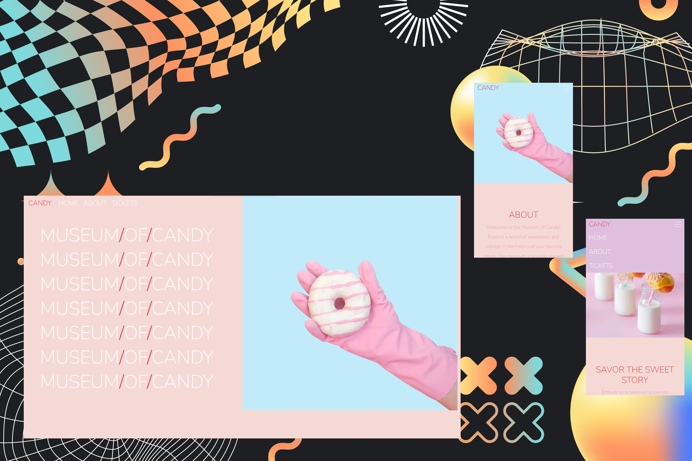

# 🍭 Museum of Candy - Web Development Bootcamp Exercise 🍬

Welcome to the Museum of Candy website, a responsive web application created as a practice exercise based on the Udemy Web Developer Bootcamp course.

- [Live Demo](https://lisztomania23.github.io/Museum-of-Candy-webDev-bootcamp/) - Experience the Museum of Candy website in action by visiting the live demo.

> This exercise was a code-along session following the completion of the HTML, CSS, and Bootstrap sections of the course. The primary focus of this practical exercise was to sharpen the skills needed for the effective application of Bootstrap. While websites built with Bootstrap may often exhibit a consistent structure, this exercise placed a special emphasis on the art of differentiation. It demonstrated that, even within the Bootstrap framework, one can create web designs that are truly distinct and unique, setting them apart from the crowd.

## 🍫 Key Features

- Responsive design using Bootstrap, ensuring a great user experience on both desktop and mobile devices.
- A visually appealing and informative layout that showcases the Museum of Candy.
- A booking form modal for visitors to book tickets to the museum.

## 🍪 Technology Stack

- 🍦 HTML
- 🍧 CSS
- 🍨 Bootstrap
- 🍡 JS

## 🍩 Acknowledgments

I am grateful that I took '[The Web Developer Bootcamp](https://www.udemy.com/course/the-web-developer-bootcamp/)' course by [Colt Steele](https://www.udemy.com/user/coltsteele/). This course has been a big help in improving my web development skills. Colt Steele's teaching style is simple and enjoyable, making it easy to understand. He also introduced me to many useful resources used by developers. I also learned to use the CSS framework [Bootstrap](https://getbootstrap.com/) in this course only. I will be continuing this course and coming back for a refresher. Also, thanks to [Kevin Powell](https://www.youtube.com/@KevinPowell) for doing CSS challenges that kept me entertained along the way. And, yeah, thank you all for helping me continue my journey.

